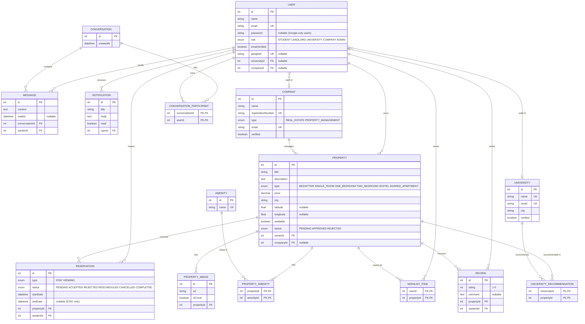

# UNI-NEST Entity Relationship Diagram

The diagram below shows all entities and their relationships
(rendered automatically by GitHub using Mermaid).

```mermaid
erDiagram
    USER ||--o{ PROPERTY : "owns"
    USER ||--o{ RESERVATION : "makes"
    USER ||--o{ WISHLIST_ITEM : "saves"
    USER ||--o{ REVIEW : "writes"
    USER ||--o{ MESSAGE : "sends"
    USER ||--o{ NOTIFICATION : "receives"
    USER }o--o| UNIVERSITY : "staff of"
    USER }o--o| COMPANY : "staff of"

    COMPANY ||--o{ PROPERTY : "manages"

    PROPERTY ||--o{ PROPERTY_IMAGE : "has"
    PROPERTY ||--o{ PROPERTY_AMENITY : "has"
    AMENITY ||--o{ PROPERTY_AMENITY : "listed in"
    PROPERTY ||--o{ RESERVATION : "receives"
    PROPERTY ||--o{ WISHLIST_ITEM : "saved as"
    PROPERTY ||--o{ REVIEW : "receives"
    PROPERTY ||--o{ UNIVERSITY_RECOMMENDATION : "recommended in"
    UNIVERSITY ||--o{ UNIVERSITY_RECOMMENDATION : "recommends"

    CONVERSATION ||--o{ CONVERSATION_PARTICIPANT : "has"
    USER ||--o{ CONVERSATION_PARTICIPANT : "joins"
    CONVERSATION ||--o{ MESSAGE : "contains"

    USER {
        int id PK
        string name
        string email UK
        string password "nullable (Google-only users)"
        enum role "STUDENT LANDLORD UNIVERSITY COMPANY ADMIN"
        boolean emailVerified
        string googleId UK "nullable"
        int universityId FK "nullable"
        int companyId FK "nullable"
    }

    UNIVERSITY {
        int id PK
        string name UK
        string email UK
        string city
        boolean verified
    }

    COMPANY {
        int id PK
        string name
        string registrationNumber UK
        enum type "REAL_ESTATE PROPERTY_MANAGEMENT"
        string email UK
        boolean verified
    }

    PROPERTY {
        int id PK
        string title
        text description
        enum type "BEDSITTER SINGLE_ROOM ONE_BEDROOM TWO_BEDROOM HOSTEL SHARED_APARTMENT"
        decimal price
        string city
        float latitude "nullable"
        float longitude "nullable"
        boolean available
        enum status "PENDING APPROVED REJECTED"
        int ownerId FK
        int companyId FK "nullable"
    }

    PROPERTY_IMAGE {
        int id PK
        string url
        boolean isCover
        int propertyId FK
    }

    AMENITY {
        int id PK
        string name UK
    }

    PROPERTY_AMENITY {
        int propertyId PK, FK
        int amenityId PK, FK
    }

    UNIVERSITY_RECOMMENDATION {
        int universityId PK, FK
        int propertyId PK, FK
    }

    RESERVATION {
        int id PK
        enum type "STAY VIEWING"
        enum status "PENDING ACCEPTED REJECTED RESCHEDULED CANCELLED COMPLETED"
        datetime startDate
        datetime endDate "nullable (STAY only)"
        int propertyId FK
        int studentId FK
    }

    WISHLIST_ITEM {
        int userId PK, FK
        int propertyId PK, FK
    }

    REVIEW {
        int id PK
        int rating "1-5"
        text comment "nullable"
        int propertyId FK
        int studentId FK
    }

    CONVERSATION {
        int id PK
        datetime createdAt
    }

    CONVERSATION_PARTICIPANT {
        int conversationId PK, FK
        int userId PK, FK
    }

    MESSAGE {
        int id PK
        text content
        datetime readAt "nullable"
        int conversationId FK
        int senderId FK
    }

    NOTIFICATION {
        int id PK
        string title
        text body
        boolean read
        int userId FK
    }
```
